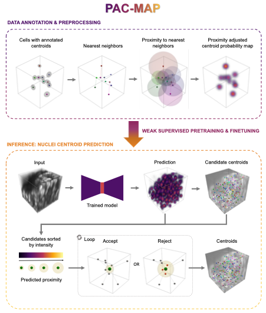

# PAC-MAP: Proximity Adjusted Centroid Mapping for Accurate Detection of Nuclei in Dense 3D Cell Systems

PAC-MAP is a novel and deep learning-based method for nuclei detection in 3D light microscopy images of (dense) 3D cell systems with a nuclear-specific stain. It works by predicting proximity adjusted centroid probability maps in which nuclei locations are found as local maxima.

A preprint of the paper will be available shortly.



The PAC-MAP workflow. Proximity adjusted centroid probability maps, i.e., the target volumes for model training, are created from images with annotated nuclei centroids by positioning Gaussian kernels at the centroid position. Each Gaussian kernel’s amplitude and standard deviation is equal to the proximity to the nearest neighbor and the average nuclei radius estimated for the dataset, respectively. A neural network is then trained by performing weak supervised pretraining with annotations from a baseline method and finetuning on manual annotations. In inference, the trained model predicts proximity adjusted centroid probability maps from which candidate centroids are extracted as local maxima. Candidates are accepted or rejected depending on the correspondence between the observed and predicted proximity to other centroids.

## Installation
Clone the repository and navigate into it. Note that the repository contains submodules, so make sure to clone it with the `--recurse-submodules` flag.
```bash
git clone --recurse-submodules https://github.com/DeVosLab/PAC-MAP.git 
cd PAC-MAP
```

Install the required packages using the following command:
```bash
conda env create -f environment.yml
```

Activate the environment:
```bash
conda activate pacmap_py3.9
```

## Usage
The repository contains code for training and evaluating PAC-MAP models on different datasets. On a high level, the code is organized in the following way:
```plaintext
configs     # Configuration files for each dataset that specifies all 
            # arguments for all scripts that were used.

pacmap      # Main package

scripts     # Scripts that uses the source code in pacmap and populates the
            # arguments with the values defined in a specified config file. 

misc        # Miscellaneous. Includes the script and conda environment     
            # file used for stardist
```

In general, one can follow all steps that were executed on a specific dataset by following its corresponding config file. 

It is recommended to execute the steps by running the scripts in the `scripts` folder with specific config files. The scripts are designed to be run from the root of the repository and will populate the arguments of the files in `pacmap` with the right values.

For instance, to divide preprocessed LN18-RED images into patches, run the following command:
```bash 
python scripts/patch_creation_script.py -f configs/LN18-RED.py -k preprocessed
```
`scripts/patch_creation_script.py` will then run `pacmap.patch_creation.py` with the arguments specified in `configs/LN18-RED.py`.
The `-f` flag specifies the config file to use (`configs/LN18-RED.py`), and the `-k` flag specifies the key in the config file to use. The key is used to access the correct dictionary in the config file, since sometimes a script will be run on multiple times on different dataset types. For instance, to also create patches of binarized LN18-RED images, run the same command with a different key:
```bash
python scripts/patch_creation_script.py -f configs/LN18-RED.py -k binarized
```

## Data
The original data used in the paper is available at [Zenodo](https://zenodo.org/records/11636385). It includes lightsheet images of spheroids of two different cell lines (LN18-RED and SH-SY5Y) and centroid annotations for model training and evaluation. The data is organized in the following way:

```plaintext
LN18-RED
├── pretrain # Pretraining data with weak annotations
│   ├── patches
│   │   ├── sample_01
│   │   │   ├── patch_0000.tif 
│   │   │   ├── ...
│   │   ├── ...
│   ├── patches_binary # Used to filter out patches with a lot of background
│   │   ├── sample_01
│   │   │   ├── patch_0000.tif
│   │   │   ├── ...
│   │   ├── ...
│   ├── points_csv # Weak centroid annotations from seeded watershed
│   │   ├── sample_01
│   │   │   ├── patch_0000.csv
│   │   │   ├── ...
│   │   ├── ...
SH-SY5Y
├── train # Training data with manual annotations
│   ├── patches
│   │   ├── sample_01
│   │   │   ├── patch_xxxx.tif
│   │   │   ├── ...
│   │   ├── ...
│   ├── points_csv
│   │   ├── sample_01
│   │   │   ├── patch_xxxx.csv
│   │   │   ├── ...
│   │   ├── ...
── test # Test data with manual annotations
    ├── patches
    │   ├── sample_01
    │   │   ├── patch_yyyy.tif
    │   │   ├── ...
    │   ├── ...
    ├── points_csv
    │   ├── sample_01
    │   │   ├── patch_yyyy.csv
    │   │   ├── ...
    │   ├── ...
preprocessed_images # Preprocessed in-toto images added for reference
├── LN18-RED
│   ├── sample_01.tif
│   ├── ...
├── SH-SY5Y
│   ├── sample_01.tif
│   ├── ...
```


