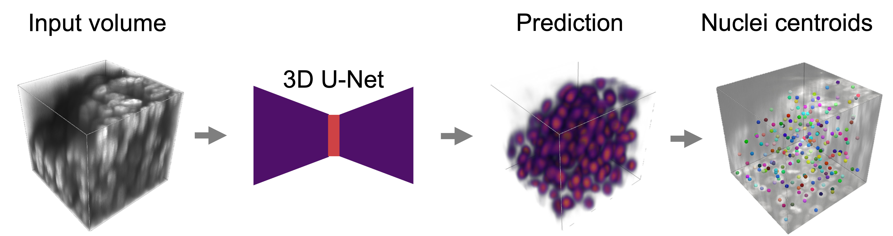

# Proximity Adjusted Centroid Mapping for Accurate Detection of Nuclei in Dense 3D Cell Systems
<p align="center">
  
</p>

Proximity Adjusted Centroid MAPping (PAC-MAP) is a novel and deep learning-based method for nuclei detection in 3D light microscopy images of (dense) 3D cell systems with a nuclear-specific stain. It works by predicting proximity adjusted centroid probability maps in which nuclei locations are found as local maxima.

**Please cite our paper if you use this code or method in your research:**

- Van De Looverbosch, Tim, Sarah De Beuckeleer, Frederik De Smet, Jan Sijbers, and Winnok H. De Vos. “Proximity Adjusted Centroid Mapping for Accurate Detection of Nuclei in Dense 3D Cell Systems.” Computers in Biology and Medicine 185 (February 1, 2025): 109561. https://doi.org/10.1016/j.compbiomed.2024.109561.

## The PAC-MAP workflow
<p align="center">
  
</p>

Proximity adjusted centroid probability maps, i.e., the target volumes for model training, are created from images with annotated nuclei centroids by positioning Gaussian kernels at the centroid position. Each Gaussian kernel’s amplitude and standard deviation is equal to the proximity to the nearest neighbor and the average nuclei radius estimated for the dataset, respectively. A neural network is then trained by performing weak supervised pretraining with annotations from a baseline method and finetuning on manual annotations. In inference, the trained model predicts proximity adjusted centroid probability maps from which candidate centroids are extracted as local maxima. Candidates are accepted or rejected depending on the correspondence between the observed and predicted proximity to other centroids.

## Installation
**1) Clone the repository and navigate into it**

Note that the repository contains submodules, so make sure to clone it with the `--recurse-submodules` flag.

```bash
git clone --recurse-submodules https://github.com/DeVosLab/PAC-MAP.git 
cd PAC-MAP
```
In case you already cloned the repository without the submodules, you can initialize and update them with the following commands:
```bash
git submodule update --init --recursive
```

**2) Install the required packages**

We recommend using mamba instead of conda if available, as it provides faster dependency resolution. In case mamba is not installed, you can replace it with conda in the following commands.

For linux and macos:
```bash
mamba env create -f environment.yml
```
For windows:
```bash
mamba env create -f environment_win.yml
```

**3) Activate the environment**
```bash
mamba activate pacmap_py3.9
```

**4) Optionally: Create a `.env` file in the root of the repository with the following content:**
```
DATA_PATH=/path/to/data
MODELS_PATH=/path/to/models
```
The `DATA_PATH` directory contains the data for each dataset, e.g., `dataset_name/train/...` 
The `MODELS_PATH` directory contains the trained models and trained models.
Data an model related paths will be interpreted relative to these predefined paths.

This is useful if all your datasets and models are stored in the same directory. In case different datasets or models are stored in different directories, you can also set the `DATA_PATH` and `MODELS_PATH` as keys in the config files. The `DATA_PATH` and `MODELS_PATH` in the condig file will overrule the ones in the `.env` file. For example:
```python 
config = {
  'DATA_PATH': '/path/to/data',
  'MODELS_PATH': '/path/to/models',
}
```

## Usage
The repository contains code for training and evaluating PAC-MAP models on different datasets. On a high level, the code is organized in the following way:
```plaintext
configs     # Configuration files for each dataset that specifies all 
            # arguments for all scripts that were used.

pacmap      # Main package

scripts     # Scripts that uses the source code in pacmap and populates the
            # arguments with the values defined in a specified config file. 

misc        # Miscellaneous. Includes the script and conda environment     
            # file used for stardist
```

### For provided datasets
For the provided datasets (see [Data](#data)), one can follow all steps that were executed on a specific dataset by following its corresponding config file. 

It is recommended to execute the steps by running the scripts in the `scripts` folder with specific config files. The scripts are designed to be run from the root of the repository and will populate the arguments of the files in `pacmap` with the right values.

For instance, to divide preprocessed LN18-RED images into patches, run the following command:
```bash 
python scripts/patch_creation_script.py -f configs/LN18-RED.py -k preprocessed
```
`scripts/patch_creation_script.py` will then run `pacmap.patch_creation.py` with the arguments specified in `configs/LN18-RED.py`.
The `-f` flag specifies the config file to use (`configs/LN18-RED.py`), and the `-k` flag specifies the key in the config file to use. The key is used to access the correct dictionary in the config file, since sometimes a script will be run multiple times on different dataset types. For instance, to also create patches of binarized LN18-RED images, run the same command with a different key:
```bash
python scripts/patch_creation_script.py -f configs/LN18-RED.py -k binarized
```

### For new datasets
For a new dataset named `dataset_name`
1) Create a new directory `dataset_name` in the `DATA_PATH` folder (see point 4 in [Installation](#installation)). Subdivide the data into `train` and `test` folders if needed (validation data will be sampled from the train set).
2) Create a new config file `dataset_name.py` in the `configs` folder.
3) Populate the config file with the correct paths and parameters.
4) Run the scripts in the `scripts` folder with the config file as argument (see [For provided datasets](#for-provided-datasets)).

## Data
The original data used in the paper is available at [Zenodo](https://zenodo.org/records/14138806). It includes lightsheet images of spheroids of two different cell lines (LN18-RED and SH-SY5Y) and centroid annotations for model training and evaluation. In addition, weights of pretrained, finetuned and trained from scratch models are provided.


